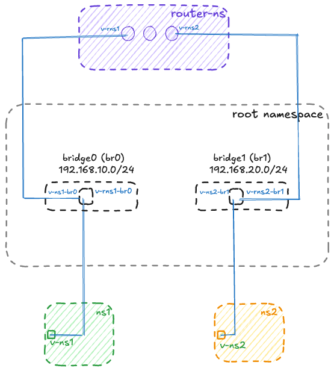

### background
network namespaces in Linux allow for the creation of isolated network environments within a single host. This assignment will help you understand how to create and manage multiple network namespaces and connect them using bridges and routing.

### main objective
create a network simulation with two separate networks connected via a router using Linux network namespaces and bridges.

### required components

- **network bridges**
	- bridge 0 (br0)
	- bridge 1 (br1)

- **network namespaces**
	- namespace 1 (ns1) - connected to br0
	- namespace 2 (ns2) - connected to br1
	- router namespace (router) - connects both bridges

### required tasks
- create network bridges
	- set up br0 and br1
	- ensure bridges are properly configured and active

- create network namespaces
	- create three separate network namespaces (ns1, ns2, router-ns)
	- verify namespace creation

- create virtual interfaces and connections
	- create appropriate virtual ethernet (veth) pairs
	- connect interfaces to correct namespaces
	- connect interfaces to appropriate bridges

- configure IP addresses
	- assign appropriate IP addresses to all interfaces
	- ensure proper subnet configuration
	- document your IP addressing scheme

- set up routing
	- configure routing between namespaces
	- enable IP forwarding where necessary
	- establish default routes

- enable and test connectivity
	- ensure ping works between ns1 and ns2
	- document and test all network paths
	- verify full connectivity

### bonus challenge
Implement your solution using either:
- A bash script for automation
- A Makefile for automated setup and teardown

### deliverables
- complete implementation (either manual commands or automation script)
- network diagram showing your topology
- documentation of:
	- IP addressing scheme
	- routing configuration
	- testing procedures and results

### technical requirements
- all commands must be executed with root privileges
- solution must work on a standard Linux system

### evaluation criteria
- correct network topology implementation
- proper isolation between namespaces
- successful routing between networks
- code quality (if automation is implemented)
- documentation quality

### note
remember to add a clean up function to clean your network namespaces and bridges after testing to avoid conflicts with other network configurations.

---

### lab solution

#### IP addressing scheme

- **Bridge 0 (br0)**: `192.168.10.0/24`
  - ns1: `192.168.10.2/24`
  - router (v-rns1): `192.168.10.1/24` (gateway)

- **Bridge 1 (br1)**: `192.168.20.0/24`
  - ns2: `192.168.20.2/24`
  - router (v-rns2): `192.168.20.1/24` (gateway)

#### network topology



#### running instructions

- Copy the manual commands into a terminal and execute them line by line
- Or save the Makefile and run `make setup`, `make verify`, `make ping`, and `make clean`
- Or save the bash script as `main.sh`, make it executable with `chmod +x main.sh`, and run `sudo ./main.sh full`
- All commands require root privileges (use `sudo` or switch to root with `sudo su`)
- After testing, always run cleanup to remove namespaces and bridges

##### manual commands
```sh
#!/bin/bash
# manual commands

#------------------------------------------------------------------------------
# setup environment
#------------------------------------------------------------------------------
sudo apt update && sudo apt upgrade -y
sudo apt install -y iproute2 net-tools

# enable IP forwarding in the Linux kernel
sudo sysctl -w net.ipv4.ip_forward=1

#------------------------------------------------------------------------------
# create namespaces
#------------------------------------------------------------------------------
sudo ip netns add ns1
sudo ip netns add ns2
sudo ip netns add router-ns

# verify
sudo ip netns list

#------------------------------------------------------------------------------
# create two linux bridges in the root namespace
#------------------------------------------------------------------------------
sudo ip link add br0 type bridge
sudo ip link add br1 type bridge

# bring bridges up
sudo ip link set br0 up
sudo ip link set br1 up

#------------------------------------------------------------------------------
# create veth pairs for ns1 <-> br0 and router-ns <-> br0
#------------------------------------------------------------------------------
sudo ip link add v-ns1 type veth peer name v-ns1-br0
sudo ip link add v-rns1 type veth peer name v-rns1-br0

# create veth pairs for ns2 <-> br1 and router-ns <-> br1
sudo ip link add v-ns2 type veth peer name v-ns2-br1
sudo ip link add v-rns2 type veth peer name v-rns2-br1

#------------------------------------------------------------------------------
# move one end of each pair into the namespaces
#------------------------------------------------------------------------------
# ns1 side
sudo ip link set v-ns1 netns ns1

# ns2 side
sudo ip link set v-ns2 netns ns2

# router side
sudo ip link set v-rns1 netns router-ns
sudo ip link set v-rns2 netns router-ns

#------------------------------------------------------------------------------
# connect the other ends to the bridges (root namespace)
#------------------------------------------------------------------------------
sudo ip link set v-ns1-br0 master br0
sudo ip link set v-rns1-br0 master br0
sudo ip link set v-ns2-br1 master br1
sudo ip link set v-rns2-br1 master br1

# bring these links up in root
sudo ip link set v-ns1-br0 up
sudo ip link set v-rns1-br0 up
sudo ip link set v-ns2-br1 up
sudo ip link set v-rns2-br1 up

#------------------------------------------------------------------------------
# configure IPs inside namespaces
#------------------------------------------------------------------------------
# ns1 (v-ns1) on 192.168.10.0/24
sudo ip netns exec ns1 ip addr add 192.168.10.2/24 dev v-ns1
sudo ip netns exec ns1 ip link set v-ns1 up
sudo ip netns exec ns1 ip link set lo up
sudo ip netns exec ns1 ip route add default via 192.168.10.1

# ns2 (v-ns2) on 192.168.20.0/24
sudo ip netns exec ns2 ip addr add 192.168.20.2/24 dev v-ns2
sudo ip netns exec ns2 ip link set v-ns2 up
sudo ip netns exec ns2 ip link set lo up
sudo ip netns exec ns2 ip route add default via 192.168.20.1

# router namespace: interface into br0 (192.168.10.0/24) and br1 (192.168.20.0/24)
sudo ip netns exec router-ns ip addr add 192.168.10.1/24 dev v-rns1
sudo ip netns exec router-ns ip addr add 192.168.20.1/24 dev v-rns2
sudo ip netns exec router-ns ip link set v-rns1 up
sudo ip netns exec router-ns ip link set v-rns2 up
sudo ip netns exec router-ns ip link set lo up

# enable IP forwarding INSIDE the router namespace
sudo ip netns exec router-ns sysctl -w net.ipv4.ip_forward=1

#------------------------------------------------------------------------------
# configure iptables to allow forwarding through bridges
#------------------------------------------------------------------------------
sudo iptables --append FORWARD --in-interface br0 --jump ACCEPT
sudo iptables --append FORWARD --in-interface br1 --jump ACCEPT
sudo iptables --append FORWARD --out-interface br0 --jump ACCEPT
sudo iptables --append FORWARD --out-interface br1 --jump ACCEPT

#------------------------------------------------------------------------------
# verify setup before testing
#------------------------------------------------------------------------------
echo "==> Verifying namespace interfaces"
sudo ip netns exec ns1 ip addr show
sudo ip netns exec ns2 ip addr show
sudo ip netns exec router-ns ip addr show

echo "==> Verifying bridges"
bridge link show br0
bridge link show br1

echo "==> Verifying IP forwarding in router namespace"
sudo ip netns exec router-ns sysctl net.ipv4.ip_forward

#------------------------------------------------------------------------------
# connectivity tests
#------------------------------------------------------------------------------
echo "==> Testing connectivity from ns1"
echo "  [ns1 -> router] Pinging router gateway (192.168.10.1)..."
sudo ip netns exec ns1 ping -c 3 192.168.10.1

echo "  [ns1 -> ns2] Pinging ns2 (192.168.20.2) via router..."
sudo ip netns exec ns1 ping -c 3 192.168.20.2

echo "==> Testing connectivity from ns2"
echo "  [ns2 -> router] Pinging router gateway (192.168.20.1)..."
sudo ip netns exec ns2 ping -c 3 192.168.20.1

echo "  [ns2 -> ns1] Pinging ns1 (192.168.10.2) via router..."
sudo ip netns exec ns2 ping -c 3 192.168.10.2

echo "✓ All connectivity tests completed"

#------------------------------------------------------------------------------
# cleanup function
#------------------------------------------------------------------------------
sudo ip netns del ns1 2>/dev/null || true
sudo ip netns del ns2 2>/dev/null || true
sudo ip netns del router-ns 2>/dev/null || true
sudo ip link del br0 2>/dev/null || true
sudo ip link del br1 2>/dev/null || true
sudo iptables -D FORWARD -i br0 -j ACCEPT 2>/dev/null || true
sudo iptables -D FORWARD -i br1 -j ACCEPT 2>/dev/null || true
sudo iptables -D FORWARD -o br0 -j ACCEPT 2>/dev/null || true
sudo iptables -D FORWARD -o br1 -j ACCEPT 2>/dev/null || true
```

##### makefile
```makefile
# Makefile for network namespace simulation
.PHONY: setup verify ping clean help

help:
	@echo "Network Namespace Simulation - Available targets:"
	@echo "  make setup   - Create and configure network topology"
	@echo "  make verify  - Verify network configuration"
	@echo "  make ping    - Test connectivity between namespaces"
	@echo "  make clean   - Remove all network namespaces and bridges"

setup:
	@echo "==> Setting up network namespaces and bridges..."
	@sudo apt update && sudo apt upgrade -y
	@sudo apt install -y iproute2 net-tools
	@sudo sysctl -w net.ipv4.ip_forward=1
	@echo "Creating namespaces..."
	@sudo ip netns add ns1 2>/dev/null || true
	@sudo ip netns add ns2 2>/dev/null || true
	@sudo ip netns add router-ns 2>/dev/null || true
	@echo "Creating bridges..."
	@sudo ip link add br0 type bridge 2>/dev/null || true
	@sudo ip link add br1 type bridge 2>/dev/null || true
	@sudo ip link set br0 up
	@sudo ip link set br1 up
	@echo "Creating veth pairs..."
	@sudo ip link add v-ns1 type veth peer name v-ns1-br0 2>/dev/null || true
	@sudo ip link add v-rns1 type veth peer name v-rns1-br0 2>/dev/null || true
	@sudo ip link add v-ns2 type veth peer name v-ns2-br1 2>/dev/null || true
	@sudo ip link add v-rns2 type veth peer name v-rns2-br1 2>/dev/null || true
	@echo "Moving interfaces to namespaces..."
	@sudo ip link set v-ns1 netns ns1
	@sudo ip link set v-ns2 netns ns2
	@sudo ip link set v-rns1 netns router-ns
	@sudo ip link set v-rns2 netns router-ns
	@echo "Attaching veth pairs to bridges..."
	@sudo ip link set v-ns1-br0 master br0
	@sudo ip link set v-rns1-br0 master br0
	@sudo ip link set v-ns2-br1 master br1
	@sudo ip link set v-rns2-br1 master br1
	@echo "Bringing up interfaces in root namespace..."
	@sudo ip link set v-ns1-br0 up
	@sudo ip link set v-rns1-br0 up
	@sudo ip link set v-ns2-br1 up
	@sudo ip link set v-rns2-br1 up
	@echo "Configuring IPs in namespaces..."
	@sudo ip netns exec ns1 ip addr add 192.168.10.2/24 dev v-ns1
	@sudo ip netns exec ns1 ip link set v-ns1 up
	@sudo ip netns exec ns1 ip link set lo up
	@sudo ip netns exec ns1 ip route add default via 192.168.10.1
	@sudo ip netns exec ns2 ip addr add 192.168.20.2/24 dev v-ns2
	@sudo ip netns exec ns2 ip link set v-ns2 up
	@sudo ip netns exec ns2 ip link set lo up
	@sudo ip netns exec ns2 ip route add default via 192.168.20.1
	@sudo ip netns exec router-ns ip addr add 192.168.10.1/24 dev v-rns1
	@sudo ip netns exec router-ns ip addr add 192.168.20.1/24 dev v-rns2
	@sudo ip netns exec router-ns ip link set v-rns1 up
	@sudo ip netns exec router-ns ip link set v-rns2 up
	@sudo ip netns exec router-ns ip link set lo up
	@sudo ip netns exec router-ns sysctl -w net.ipv4.ip_forward=1
	@echo "Configuring iptables..."
	@sudo iptables -C FORWARD -i br0 -j ACCEPT 2>/dev/null || sudo iptables -A FORWARD -i br0 -j ACCEPT
	@sudo iptables -C FORWARD -i br1 -j ACCEPT 2>/dev/null || sudo iptables -A FORWARD -i br1 -j ACCEPT
	@sudo iptables -C FORWARD -o br0 -j ACCEPT 2>/dev/null || sudo iptables -A FORWARD -o br0 -j ACCEPT
	@sudo iptables -C FORWARD -o br1 -j ACCEPT 2>/dev/null || sudo iptables -A FORWARD -o br1 -j ACCEPT
	@echo "✓ Setup complete"

verify:
	@echo "==> Checking namespace interfaces"
	@echo "ns1 interfaces:"
	@sudo ip netns exec ns1 ip addr show
	@echo ""
	@echo "ns2 interfaces:"
	@sudo ip netns exec ns2 ip addr show
	@echo ""
	@echo "router-ns interfaces:"
	@sudo ip netns exec router-ns ip addr show
	@echo ""
	@echo "==> Checking bridge configurations"
	@echo "Bridge br0:"
	@bridge link show br0
	@echo ""
	@echo "Bridge br1:"
	@bridge link show br1
	@echo ""
	@echo "==> Checking IP forwarding in router namespace"
	@sudo ip netns exec router-ns sysctl net.ipv4.ip_forward
	@echo ""
	@echo "==> Checking ARP tables"
	@echo "Router ARP table:"
	@sudo ip netns exec router-ns ip neigh show

ping:
	@echo "==> Testing connectivity from ns1"
	@echo "  [ns1 -> ROUTER] Pinging router gateway (192.168.10.1)..."
	@sudo ip netns exec ns1 ping -c 3 192.168.10.1
	@echo ""
	@echo "  [ns1 -> ns2] Pinging ns2 (192.168.20.2) via router..."
	@sudo ip netns exec ns1 ping -c 3 192.168.20.2
	@echo ""
	@echo "==> Testing connectivity from ns2"
	@echo "  [ns2 -> ROUTER] Pinging router gateway (192.168.20.1)..."
	@sudo ip netns exec ns2 ping -c 3 192.168.20.1
	@echo ""
	@echo "  [ns2 -> ns1] Pinging ns1 (192.168.10.2) via router..."
	@sudo ip netns exec ns2 ping -c 3 192.168.10.2
	@echo ""
	@echo "✓ All connectivity tests completed"

clean:
	@echo "==> Cleaning up network namespaces and bridges..."
	@sudo ip netns del ns1 2>/dev/null || true
	@sudo ip netns del ns2 2>/dev/null || true
	@sudo ip netns del router-ns 2>/dev/null || true
	@sudo ip link del br0 2>/dev/null || true
	@sudo ip link del br1 2>/dev/null || true
	@sudo iptables -D FORWARD -i br0 -j ACCEPT 2>/dev/null || true
	@sudo iptables -D FORWARD -i br1 -j ACCEPT 2>/dev/null || true
	@sudo iptables -D FORWARD -o br0 -j ACCEPT 2>/dev/null || true
	@sudo iptables -D FORWARD -o br1 -j ACCEPT 2>/dev/null || true
	@echo "✓ Cleanup complete"
```

##### automated bash script
```sh
#!/bin/bash

# main.sh
# automation script - network namespace simulation

set -e  # exit on error

# colors for output
RED='\033[0;31m'
GREEN='\033[0;32m'
YELLOW='\033[1;33m'
NC='\033[0m' # no color

# logging functions
log_info() {
    echo -e "${GREEN}[INFO]${NC} $1"
}

log_error() {
    echo -e "${RED}[ERROR]${NC} $1"
}

log_warning() {
    echo -e "${YELLOW}[WARNING]${NC} $1"
}

# check if running as root
check_root() {
    if [[ $EUID -ne 0 ]]; then
        log_error "This script must be run as root (switch to root: sudo su)"
        exit 1
    fi
}

# setup function
setup_network() {
    log_info "Starting network namespace setup..."
    
    # enable IP forwarding
    sysctl -w net.ipv4.ip_forward=1 > /dev/null
    
    # create namespaces
    log_info "Creating namespaces..."
    ip netns add ns1 2>/dev/null || log_warning "ns1 already exists"
    ip netns add ns2 2>/dev/null || log_warning "ns2 already exists"
    ip netns add router-ns 2>/dev/null || log_warning "router-ns already exists"
    
    # create bridges
    log_info "Creating bridges..."
    ip link add br0 type bridge 2>/dev/null || log_warning "br0 already exists"
    ip link add br1 type bridge 2>/dev/null || log_warning "br1 already exists"
    ip link set br0 up
    ip link set br1 up
    
    # create veth pairs
    log_info "Creating veth pairs..."
    ip link add v-ns1 type veth peer name v-ns1-br0 2>/dev/null || true
    ip link add v-rns1 type veth peer name v-rns1-br0 2>/dev/null || true
    ip link add v-ns2 type veth peer name v-ns2-br1 2>/dev/null || true
    ip link add v-rns2 type veth peer name v-rns2-br1 2>/dev/null || true
    
    # move interfaces to namespaces
    log_info "Moving interfaces to namespaces..."
    ip link set v-ns1 netns ns1
    ip link set v-ns2 netns ns2
    ip link set v-rns1 netns router-ns
    ip link set v-rns2 netns router-ns
    
    # attach to bridges
    log_info "Attaching veth pairs to bridges..."
    ip link set v-ns1-br0 master br0
    ip link set v-rns1-br0 master br0
    ip link set v-ns2-br1 master br1
    ip link set v-rns2-br1 master br1
    
    # bring up interfaces in root
    ip link set v-ns1-br0 up
    ip link set v-rns1-br0 up
    ip link set v-ns2-br1 up
    ip link set v-rns2-br1 up
    
    # configure IPs
    log_info "Configuring IP addresses..."
    ip netns exec ns1 ip addr add 192.168.10.2/24 dev v-ns1
    ip netns exec ns1 ip link set v-ns1 up
    ip netns exec ns1 ip link set lo up
    ip netns exec ns1 ip route add default via 192.168.10.1
    
    ip netns exec ns2 ip addr add 192.168.20.2/24 dev v-ns2
    ip netns exec ns2 ip link set v-ns2 up
    ip netns exec ns2 ip link set lo up
    ip netns exec ns2 ip route add default via 192.168.20.1
    
    ip netns exec router-ns ip addr add 192.168.10.1/24 dev v-rns1
    ip netns exec router-ns ip addr add 192.168.20.1/24 dev v-rns2
    ip netns exec router-ns ip link set v-rns1 up
    ip netns exec router-ns ip link set v-rns2 up
    ip netns exec router-ns ip link set lo up
    ip netns exec router-ns sysctl -w net.ipv4.ip_forward=1 > /dev/null
    
    # configure iptables
    log_info "Configuring iptables..."
    iptables -C FORWARD -i br0 -j ACCEPT 2>/dev/null || iptables -A FORWARD -i br0 -j ACCEPT
    iptables -C FORWARD -i br1 -j ACCEPT 2>/dev/null || iptables -A FORWARD -i br1 -j ACCEPT
    iptables -C FORWARD -o br0 -j ACCEPT 2>/dev/null || iptables -A FORWARD -o br0 -j ACCEPT
    iptables -C FORWARD -o br1 -j ACCEPT 2>/dev/null || iptables -A FORWARD -o br1 -j ACCEPT
    
    log_info "Setup complete!"
}

# verify function
verify_network() {
    log_info "Verifying network configuration..."
    
    echo ""
    echo "==> Namespace list:"
    ip netns list
    
    echo ""
    echo "==> Bridge configurations:"
    bridge link show br0
    bridge link show br1
    
    echo ""
    echo "==> IP forwarding in router:"
    ip netns exec router-ns sysctl net.ipv4.ip_forward
    
    log_info "Verification complete!"
}

# test connectivity
test_connectivity() {
    log_info "Testing connectivity..."
    
    echo ""
    echo "==> Testing ns1 -> router (192.168.10.1)"
    ip netns exec ns1 ping -c 3 192.168.10.1
    
    echo ""
    echo "==> Testing ns1 -> ns2 (192.168.20.2)"
    ip netns exec ns1 ping -c 3 192.168.20.2
    
    echo ""
    echo "==> Testing ns2 -> router (192.168.20.1)"
    ip netns exec ns2 ping -c 3 192.168.20.1
    
    echo ""
    echo "==> Testing ns2 -> ns1 (192.168.10.2)"
    ip netns exec ns2 ping -c 3 192.168.10.2
    
    log_info "All connectivity tests passed!"
}

# cleanup function
cleanup_network() {
    log_info "Cleaning up network namespaces and bridges..."
    
    ip netns del ns1 2>/dev/null || true
    ip netns del ns2 2>/dev/null || true
    ip netns del router-ns 2>/dev/null || true
    ip link del br0 2>/dev/null || true
    ip link del br1 2>/dev/null || true
    iptables -D FORWARD -i br0 -j ACCEPT 2>/dev/null || true
    iptables -D FORWARD -i br1 -j ACCEPT 2>/dev/null || true
    iptables -D FORWARD -o br0 -j ACCEPT 2>/dev/null || true
    iptables -D FORWARD -o br1 -j ACCEPT 2>/dev/null || true
    
    log_info "Cleanup complete!"
}

# main menu
show_menu() {
    echo ""
    echo "Network Namespace Simulation Script"
    echo "===================================="
    echo "1. Setup network"
    echo "2. Verify configuration"
    echo "3. Test connectivity"
    echo "4. Cleanup"
    echo "5. Full run (setup + verify + test)"
    echo "6. Exit"
    echo ""
}

# main function
main() {
    check_root
    
    if [[ $# -eq 0 ]]; then
        # interactive mode
        while true; do
            show_menu
            read -p "Select option: " choice
            case $choice in
                1) setup_network ;;
                2) verify_network ;;
                3) test_connectivity ;;
                4) cleanup_network ;;
                5) setup_network && verify_network && test_connectivity ;;
                6) exit 0 ;;
                *) log_error "Invalid option" ;;
            esac
        done
    else
        # command line mode
        case $1 in
            setup) setup_network ;;
            verify) verify_network ;;
            test) test_connectivity ;;
            clean) cleanup_network ;;
            full) setup_network && verify_network && test_connectivity ;;
            *) 
                echo "Usage: $0 {setup|verify|test|clean|full}"
                exit 1
                ;;
        esac
    fi
}

main "$@"
```
