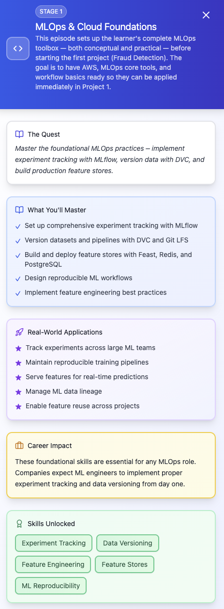

## Episode 01

- **module 1** — experiment tracking & model metadata management (MLflow)
  - MLflow components: tracking, registry, models, projects
  - Deploy MLflow on AWS EC2 with RDS (Postgres) and S3 artifact storage
  - Authentication and TLS setup with Nginx reverse proxy
  - Logging metrics, parameters, and artifacts
  - Integrating MLflow with scikit-learn, PyTorch, TensorFlow
- **module 2** — data & pipeline versioning (DVC, git-lfs)
  - Versioning datasets alongside code
  - Using DVC with S3 remote storage
  - Git LFS for large file handling
  - Data lineage and reproducibility with DVC
  - Integrating DVC with MLFlow
- **module 3** — feature stores & databases (Feast, Redis, Postgres)
  - Feature store fundamentals: entities, feature views, materialization
  - Deploy Feast with S3 offline store and Redis online store on AWS
  - Freshness metrics and monitoring feature health
  - Online/offline feature consistency
- **module 4** — API development with FastAPI for model serving
  - Designing inference APIs for ML models
  - Loading and serving MLflow-registered models in FastAPI
  - Securing endpoints with API keys and rate limiting
  - Instrumentation with Prometheus metrics endpoints
- **module 5** — CI/CD for ML services
  - GitHub Actions workflows for ML model CI
  - Docker build & push to AWS ECR
  - Canary and blue/green deployment strategies overview
  - Connecting CI/CD with MLflow model promotion
- **module 6** — monitoring & observability for ML systems
  - Metrics: infra, application, model
  - Deploy Prometheus & Grafana on AWS EC2
  - Dashboarding model accuracy, latency, drift indicators
  - Alerting with Alertmanager + SNS

