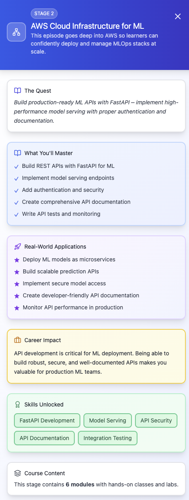

## episode 02

- **module 1** — AWS fundamentals for MLOps
  - AWS global infrastructure overview
  - Regions, AZs, VPC basics
  - IAM essentials (users, roles, policies, least privilege)
  - Cost guardrails: Budgets, billing alerts, tagging strategies
- **module 2** — compute & storage for ML
  - EC2 instance types for ML workloads
  - Configuring S3 buckets for ML data and artifacts
  - S3 lifecycle policies & storage classes
  - Using RDS (Postgres/MySQL) for ML metadata
- **module 3** — networking for ML systems
  - VPC design for ML workloads
  - Subnets (public vs private), route tables, NAT gateways
  - Security groups and NACLs
  - PrivateLink and VPC endpoints for secure AWS service access
- **module 4** — load balancing, scaling & reliability
  - Elastic Load Balancing (ALB/NLB) for ML APIs
  - Auto Scaling Groups for serving workloads
  - Scaling policies for latency, CPU, or custom metrics
  - High availability patterns in AWS
- **module 5** — infrastructure as code for AWS
  - Terraform & Pulumi basics for AWS infra
  - Modular infrastructure patterns
  - Using variables, workspaces, and state management
  - CI/CD for IaC

