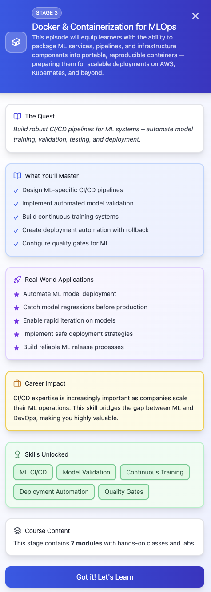

## episode 03

- **module 1** — docker fundamentals for ML workloads
  - What is containerization and why it matters in MLOps
  - Comparing VMs and containers (pros, cons, resource usage)
  - Installing and configuring Docker for development
  - Understanding images, containers, layers, and registries
  - The role of containerization in reproducible ML experiments
- **module 2** — writing Dockerfiles for ML applications
  - Best practices for structuring Dockerfiles for Python/ML projects
  - Multi-stage builds to reduce image size
  - Managing Python dependencies with pip, poetry, or conda in containers
  - Using .dockerignore to reduce build context size
  - Incorporating system-level dependencies (OpenCV, CUDA libraries, etc.)
- **module 3** — containerizing ML APIs and batch jobs
  - Packaging a FastAPI model-serving service into a container
  - Building containers for data preprocessing and ETL jobs
  - Entrypoints and CMD for batch processing containers
  - Passing environment variables and secrets securely
  - Performance considerations (CPU pinning, memory limits, caching layers)
- **module 4** — managing Docker images & registries
  - Using Docker Hub, AWS ECR
  - Versioning ML service images for rollback and reproducibility
  - Image scanning for vulnerabilities (Trivy, Grype)
  - Automating builds and pushes via CI/CD pipelines
  - Cleaning up unused images and layers to reduce costs
- **module 5** — multi-container architectures for ML systems
  - Using Docker Compose for local multi-service ML stacks (API + DB + monitoring)
  - Defining service dependencies (e.g., FastAPI + Redis + MLflow + Kafka)
  - Networking containers together
  - Sharing volumes for feature stores and artifact storage
  - Local dev workflow for end-to-end pipelines
- **module 6** — debugging & optimizing containers
  - Inspecting running containers (logs, exec, stats)
  - Measuring container resource usage (CPU, memory, GPU, network)
  - Reducing cold-start latency for ML APIs
  - Caching dependencies for faster builds
  - Handling container crashes and restart policies

