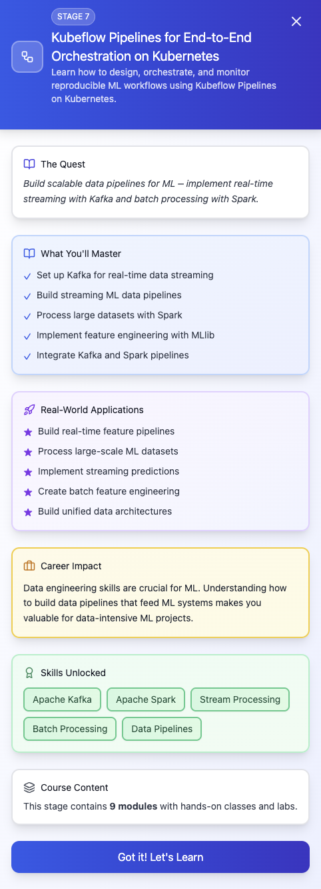

## episode 07

- **module 8.1** — introduction to Kubeflow for MLOps
  - What is Kubeflow? Why it matters for production ML
  - Core components: Pipelines, KFServing, Katib, Metadata
  - Kubeflow vs Airflow vs Argo Workflows
  - Real-world use cases of Kubeflow in ML teams
- **module 8.2** — setting up Kubeflow on Kubernetes
  - Deploying Kubeflow on AWS EKS using manifests/Helm
  - Configuring authentication (Dex, OIDC)
  - Integrating with AWS S3 for artifact storage
  - Connecting Kubeflow to an external MLflow tracking server
- **module 8.3** — creating your first ML pipeline
  - Pipeline structure: components, DAGs, parameters
  - Writing Kubeflow components in Python
  - Passing data and artifacts between pipeline steps
  - Versioning pipelines and tracking executions
- **module 8.4** — advanced pipeline patterns
  - Parallelism and conditional execution
  - Caching and skipping steps for faster reruns
  - Reusable components and shared libraries
  - Multi-model pipelines (ensembles, experiments)
- **module 8.5** — hyperparameter tuning with Katib
  - Katib architecture and integration with Kubeflow Pipelines
  - Defining search spaces and objectives
  - Distributed hyperparameter tuning
  - Logging Katib results to MLflow
- **module 8.6** — continuous training & deployment pipelines
  - Automating retraining with new data triggers
  - CI/CD for pipelines using GitHub Actions and ArgoCD
  - Canary and blue/green deployments with KFServing
  - Integrating model registry (MLflow/Kubeflow)
- **module 8.7** — serving models with KFServing
  - KFServing architecture and model serving patterns
  - Deploying models as REST and gRPC endpoints
  - Scaling inference services with autoscaling
  - A/B testing models in production
- **module 8.8** — monitoring & observability in Kubeflow
  - Pipeline run metadata tracking
  - Exporting pipeline metrics to Prometheus/Grafana
  - Model performance monitoring in production
  - Drift detection integration with Evidently

