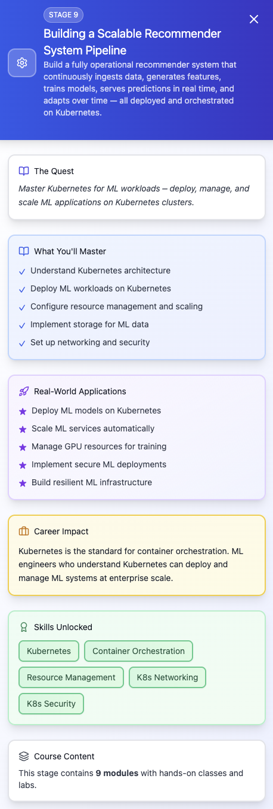

## episode 09

- **module 9.1** — problem definition & system architecture
  - Understanding recommendation problem types (content-based, collaborative filtering, hybrid)
  - Business and ML requirements for recommender systems
  - High-level architecture on Kubernetes (data -> features -> model -> serving -> monitoring)
  - Components: Kubeflow Pipelines, Ray, Feast, KFServing, Prometheus/Grafana
- **module 9.2** — data ingestion & processing
  - Sources: user interactions, item metadata, transaction history
  - Batch vs streaming ingestion in Kubernetes
  - Ingestion pipeline with Kafka for streaming events and Spark for batch
  - Schema design for recommendation datasets
- **module 9.3** — feature engineering with Feast
  - Setting up Feast in Kubernetes (Redis + S3)
  - Defining entities, features, and feature views for recommendations
  - Materializing offline -> online store
  - Handling TTL and freshness in real-time features
- **module 9.4** — distributed training with Ray on Kubernetes
  - Ray cluster setup on Kubernetes
  - Parallelizing model training (matrix factorization, deep learning-based recommenders)
  - Ray Tune for hyperparameter optimization
  - Integrating Ray with MLflow for experiment tracking
- **module 9.5** — orchestrating the pipeline with Kubeflow
  - Writing Kubeflow components for data ingestion, feature generation, model training, evaluation, and deployment
  - Defining pipeline parameters (dataset, hyperparameters, model type)
  - Scheduling periodic runs
- **module 9.6** — model evaluation & A/B testing
  - Offline evaluation metrics: precision@k, recall@k, MAP, NDCG
  - Online evaluation: A/B tests with live traffic
  - Canary deployments and traffic splitting with KFServing
- **module 9.7** — real-time serving with KFServing
  - Deploying recommendation models as scalable REST endpoints
  - Handling feature lookups in real-time requests
  - Scaling inference with Ray Serve
- **module 9.8** — monitoring & observability
  - Tracking latency, throughput, and error rates for inference services
  - Monitoring model performance drift in recommendation quality
  - Creating Grafana dashboards for user engagement metrics
- **module 9.9** — continuous training & improvement
  - Automating retraining with new interaction data
  - Incorporating user feedback for model updates
  - Automating feature recalculation and deployment

