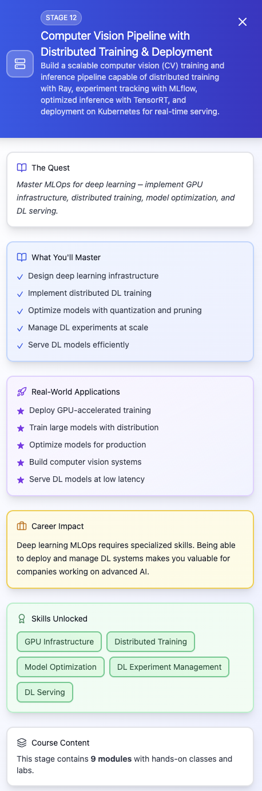

## episode 12

- **module 10.1** — problem definition & use cases
  - Common CV tasks: image classification, object detection, segmentation
  - Use case selection (e.g., real-time defect detection, product tagging)
  - Business KPIs vs ML metrics
  - High-level architecture: ingestion -> preprocessing -> training -> deployment -> monitoring
  - Lab: Draft the architecture diagram for the chosen CV application
- **module 10.2** — data acquisition & storage
  - Sources: datasets (ImageNet, COCO), customer uploads, camera streams
  - Batch ingestion from S3 and streaming ingestion with Kafka
  - Data storage strategy in cloud (S3 bucket partitioning, lifecycle policies)
  - Lab: Set up an S3-based image dataset repository with metadata indexing in PostgreSQL
- **module 10.3** — data preprocessing & augmentation
  - Preprocessing pipelines (resize, normalization, augmentation)
  - Leveraging GPU acceleration (NVIDIA DALI, OpenCV with CUDA)
  - Augmentation strategies for better generalization
  - Lab: Implement a GPU-accelerated data preprocessing pipeline and log outputs to S3
- **module 10.4** — distributed training with Ray
  - Ray cluster setup for distributed deep learning
  - Integrating PyTorch DistributedDataParallel (DDP) with Ray
  - Ray Tune for hyperparameter search (learning rate, batch size, augmentations)
  - Tracking experiments with MLflow
  - Lab: Train a ResNet-based model with Ray on Kubernetes and log results to MLflow
- **module 10.5** — model evaluation
  - Evaluation metrics for CV (accuracy, mAP, IoU)
  - Error analysis and confusion matrix interpretation
  - Logging evaluation artifacts to MLflow
  - Lab: Evaluate trained model and upload confusion matrix & sample predictions to MLflow
- **module 10.6** — model optimization with TensorRT
  - Introduction to model compression (quantization, pruning)
  - Converting PyTorch/TensorFlow models to TensorRT
  - Benchmarking latency & throughput improvements
  - Lab: Optimize the trained model with TensorRT and measure performance gains
- **module 10.7** — deployment with KFServing
  - Containerizing the optimized model
  - KFServing deployment for scalable inference
  - GPU scheduling in Kubernetes
  - Canary deployments for new CV model versions
  - Lab: Deploy TensorRT-optimized model on KFServing with GPU autoscaling
- **module 10.8** — real-time inference
  - Streaming inference pipeline
  - Handling variable versions and resolution
  - Scaling inference workloads in Kubernetes
  - Lab: Deploy a FastAPI service for real-time video object detection with WebSocket streaming
- **module 10.9** — monitoring & drift detection
  - Monitoring inference latency, FPS, and GPU utilization
  - Detecting data distribution drift in images
  - Integrating EvidentlyAI with Prometheus/Grafana
  - Lab: Build Grafana dashboards for GPU metrics and drift monitoring
- **module 10.10** — continuous training & automation
  - Automating model retraining when drift or degradation is detected
  - Updating TensorRT optimizations in retraining
  - Kubeflow Pipelines for automated retraining cycles
  - Lab: Create a Kubeflow retraining pipeline triggered by drift alerts

