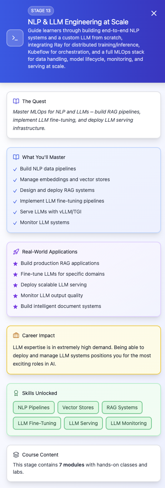

## episode 13

- **module 1** — project scaffolding, environment setup & cost guardrails
  - Repo structure for multi-model NLP project (infra/, datasets/, models/, pipelines/, services/)
  - Poetry or uv for dependency management, pre-commit hooks, linting (ruff, black), testing (pytest)
  - AWS CLI profiles, SSM Parameter Store for credentials
  - Cost monitoring with AWS Budgets & teardown scripts
  - GPU-aware environment setup (CUDA, cuDNN, NCCL)
- **module 2** — NLP data engineering & preprocessing
  - Building a text ingestion pipeline from S3 + Kafka
  - Data cleaning, deduplication, tokenization (Hugging Face Tokenizers, SentencePiece)
  - Generating and storing embeddings in Qdrant / PostgreSQL + pgvector
  - Versioning datasets with DVC (storing raw + preprocessed versions)
  - Parallel preprocessing with Ray Data
- **module 3** — experiment tracking & model registry with MLflow
  - Tracking BERT fine-tunes, embedding models, and LLM pretraining runs
  - Logging training loss, eval metrics, confusion matrices, embeddings visualizations
  - Registering models in MLflow Model Registry with stage transitions (dev -> staging -> prod)
  - Integrating MLflow with Ray Tune for distributed hyperparameter search
- **module 4** — applied NLP model development
  - Fine-tuning BERT / RoBERTa for classification, NER, QA
  - Using LoRA / PEFT for parameter-efficient fine-tuning
  - Evaluating with F1, macro/micro precision-recall, exact match (QA)
  - Exporting to ONNX/TensorRT for optimized inference
- **module 5** — LLM from scratch — architecture & training
  - Implementing Transformer architecture (multi-head attention, feed-forward, layer norm) in PyTorch
  - Pretraining on a curated corpus (wiki + domain-specific data) using Ray Train for distributed multi-GPU training
  - Mixed-precision (fp16/bf16) & gradient checkpointing for efficiency
  - Evaluating perplexity, next-token prediction accuracy
  - Saving checkpoints to S3 with metadata for reproducibility
- **module 6** — feature store for NLP pipelines
  - Using Feast to store reusable features (text embeddings, entity frequency tables)
  - Redis for online store, S3 for offline store
  - Materializing features for batch and streaming NLP pipelines
- **module 7** — deployment infrastructure for NLP models
  - Deploying inference endpoints with Ray Serve (multi-model routing: BERT classifier, embedding service, LLM)
  - Containerizing services with GPU-enabled Docker images
  - Deploying on k8s with GPU nodes & autoscaling
  - Load testing inference with Locust/k6 for latency and throughput
- **module 8** — retrieval-augmented generation (RAG) pipeline
  - Vector DB setup (Qdrant, OpenSearch, pgvector) for context retrieval
  - Building RAG workflow for LLM with Ray Serve pipelines
  - Integrating with FastAPI API layer for user queries
  - Caching retrieved contexts with Redis for hot queries
- **module 9** — API development & model serving
  - REST & gRPC endpoints for: text classification, embedding generation, LLM completion/generation
  - API key authentication & request quotas
  - Prometheus metrics for request volume, latency, model hit ratios
- **module 10** — CI/CD for NLP & LLM
  - GitHub Actions workflows for: data pipeline tests, model evaluation gates (accuracy, latency, cost), canary deployments of new model versions
  - Rollback automation on metric regression
- **module 11** — monitoring & observability
  - Prometheus + Grafana dashboards for: token generation latency, GPU utilization & memory, context retrieval latency, drift in embeddings space
  - Alertmanager rules for: latency spikes, GPU saturation, drop in model accuracy (via shadow testing)
- **module 12** — continual learning & fine-tuning in production
  - Automated feedback loops to capture real-world queries & responses
  - Daily incremental fine-tuning with Ray on recent data
  - Model validation before deployment to production

