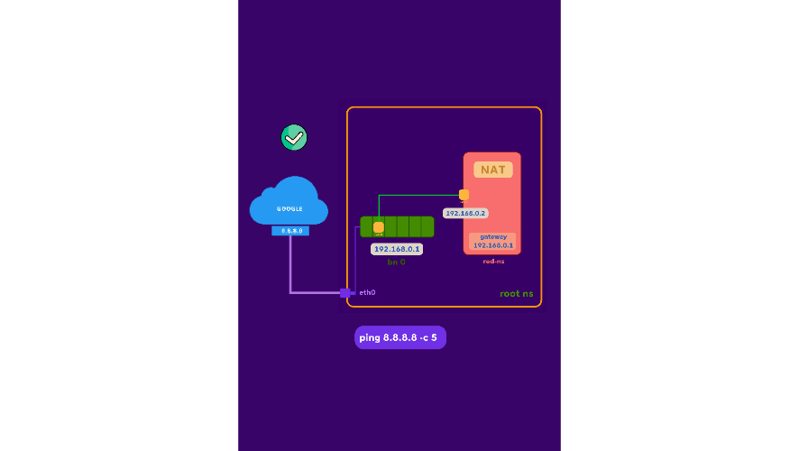

### networking namespace inspecting
within the Linux network stack:
- routes define traffic paths
- iptables configures packet filtering
- lo is a local loopback interface for testing
- eth0 is the primary Ethernet interface for external connections
```sh
$ ip link list
$ ifconfig lo
$ ip route show

# create custom network namespace
$ ip netns add poridhi
$ ip netns list

# enter network namepsace
$ ip netns exec poridhi bash
$ sudo nsenter --net=/var/run/netns/poridhi bash
$ ip link show
$ ifconfig lo
```

---
### connect network NS to host

![[scenarios/nw-ns-to-host-1.png]]

![[scenarios/nw-ns-to-host-2.png]]

```sh
sudo ip netns add red
sudo ip netns list

# creates a pair of interconnected virtual Ethernet devices from root network namespace
sudo ip link add veth-red type veth peer name veth-host
ip link list

# moves one end of the cable into the red namespace, leaves other end to root. this way root and red namespace get connected
sudo ip link set veth-red netns red

# configures IP Addresses to both end of this veth cable and once we turn up the interfaces, the peer device will instantly display any packet that appears on one of the devices.
sudo ip netns exec red ip addr add 192.168.1.1/24 dev veth-red
sudo ip netns exec red ip link set veth-red up
sudo ip addr add 192.168.1.2/24 dev veth-host
sudo ip link set veth-host up

# adds a route for veth-red
sudo ip route add 192.168.1.1 dev veth-host

ping 192.168.1.1 -c 3

# enters into red ns bash
sudo ip netns exec red bash
ip addr show dev veth-red
ping 192.168.1.2 -c 3
exit
```
---

### egress-traffic



```sh
# creates a custom network namespace `ns0` and a bridge `br0`
sudo ip netns add ns0
sudo ip link add br0 type bridge

# configures bridge interface
sudo ip link set br0 up
sudo ip addr add 192.168.0.1/16 dev br0

# confirms bridge can receive packets
ping 192.168.0.1 -c 3

# configures vistual eth cable
sudo ip link add veth0 type veth peer name ceth0
sudo ip link set ceth0 netns ns0
sudo ip link set veth0 master br0
sudo ip netns exec ns0 ip link set ceth0 up
sudo ip link set veth0 up
sudo ip netns exec ns0 bash
sudo ip link set lo up
sudo ip addr add 192.168.0.2/16 dev ceth0

# ping eth interface of root ns
ping 10.62.18.175 -c 3

# network should be unreachable
route
route add default via 192.168.0.1
ping 10.62.18.175 -c 3 # should work now

ping 8.8.8.8 -c 5 # ping google
exit
```

-  `root cause`
	- see! The source IP address, 192.168.0.2, is attempting to connect to Google DNS 8.8.8.8 using its `private IP address`. So it's very basic that the outside world can't reach that private IP because they have no idea about that particular private IP address. That's why packets are able to reach Google DNS, but we are not getting any replies from 8.8.8.8.

- `solution`
	- we must somehow change the private IP address to a public address in order to sort out this issue with the help of NAT (Network Translation Address). So, a SNAT (source NAT) rule must be added to the IP table in order to modify the POSTROUTING chain.
	- `sudo iptables -t nat -A POSTROUTING -s 192.168.0.0/16  -j MASQUERADE`

	- `role of POSTROUTING`: POSTROUTING chain in iptables is part of the NAT (Network Address Translation) table, and it is applied to packets after the routing decision has been made but before the packets are sent out of the system. The primary purpose of the POSTROUTING chain is to perform Source Network Address Translation (SNAT) or MASQUERADE on outgoing packets.
	- `MASQUERADE Action`: MASQUERADE target in iptables is used for Network Address Translation (NAT) in order to hide the true source address of outgoing packets. Here, when the packet matches the conditions specified in an iptables rule with the MASQUERADE target, the source IP address of the packet is dynamically replaced with the IP address of the outgoing interface. The NAT engine on the router or gateway replaces the private source IP address with its own public IP address before forwarding the packet to the external network. When the external network sends a reply back to the public IP address, the NAT engine tracks the translation and forwards the reply back to the original private IP address within the internal network.

```sh
# show firewall rules
sudo iptables -t nat -L -n -v

# apply postrouting and masquerade in root ns
sudo iptables -t nat -A POSTROUTING -s 192.168.0.0/16  -j MASQUERADE
sudo iptables --append FORWARD --in-interface br0 --jump ACCEPT
sudo iptables --append FORWARD --out-interface br0 --jump ACCEPT

sudo ip netns exec ns0 bash
ping 8.8.8.8 -c 5 # ping google; this time it should work
```

---
### connect two custom network ns

![[scenarios/connect-custom-nw-ns.png]]

```sh
# setup env
sudo apt update
sudo apt upgrade -y
sudo apt install iproute2
sudo apt install net-tools

# enable IP forwarding in the Linux kernel
sudo sysctl -w net.ipv4.ip_forward=1

# creates namespaces
sudo ip netns add blue-namespace
sudo ip netns add lemon-namespace

# creates virtual ethernet links pair
sudo ip link add veth-blue type veth peer name veth-lemon

# verify its created
sudo ip link list

# sets the cable as NIC
sudo ip link set veth-blue netns blue-namespace
sudo ip link set veth-lemon netns lemon-namespace

# verify
sudo ip netns exec blue-namespace ip link
sudo ip netns exec lemon-namespace ip link

# assigns ip
sudo ip netns exec blue-namespace ip addr add 192.168.0.1/24 dev veth-blue
sudo ip netns exec lemon-namespace ip addr add 192.168.0.2/24 dev veth-lemon

# sets the interfaces up
sudo ip netns exec blue-namespace ip link set veth-blue up
sudo ip netns exec lemon-namespace ip link set veth-lemon up

# sets default routes
sudo ip netns exec blue-namespace ip route add default via 192.168.0.1 dev veth-blue
sudo ip netns exec lemon-namespace ip route add default via 192.168.0.2 dev veth-lemon

# tests connectivity
sudo ip netns exec blue-namespace ping 192.168.0.2 -c 3
sudo ip netns exec lemon-namespace ping 192.168.0.1 -c 3
```

---
### process communication between namespaces

![[scenarios/process-communication-between-nw-ns.png]]

```sh
# setup env
sudo apt update
sudo apt upgrade -y
sudo apt install iproute2
sudo apt install net-tools

# enable IP forwarding in the Linux kernel
sudo sysctl -w net.ipv4.ip_forward=1

# creates namespaces
sudo ip netns add blue-namespace
sudo ip netns add lemon-namespace

# creates virtual ethernet links pair
sudo ip link add veth-blue type veth peer name veth-lemon

# verify its created
sudo ip link list

# sets the cable as NIC
sudo ip link set veth-blue netns blue-namespace
sudo ip link set veth-lemon netns lemon-namespace

# verify
sudo ip netns exec blue-namespace ip link
sudo ip netns exec lemon-namespace ip link

# assigns ip
sudo ip netns exec blue-namespace ip addr add 192.168.0.1/24 dev veth-blue
sudo ip netns exec lemon-namespace ip addr add 192.168.0.2/24 dev veth-lemon

# sets the interfaces up
sudo ip netns exec blue-namespace ip link set veth-blue up
sudo ip netns exec lemon-namespace ip link set veth-lemon up

# sets default routes
sudo ip netns exec blue-namespace ip route add default via 192.168.0.1 dev veth-blue
sudo ip netns exec lemon-namespace ip route add default via 192.168.0.2 dev veth-lemon

# tests connectivity
sudo ip netns exec blue-namespace ping 192.168.0.2 -c 3
sudo ip netns exec lemon-namespace ping 192.168.0.1 -c 3
```

- create and run a server
```sh
python3 -m venv venv
source venv/bin/activate
pip3 install flask
```


```python
# nano server.py && copy following
from flask import Flask

app = Flask(__name__)

@app.route('/')
def hello_world():
    return 'Hello world from process 2'

if __name__ == '__main__':
    app.run(host='0.0.0.0', port=3001, debug=True)
```

```sh
sudo ip netns exec blue-namespace /bin/bash
curl -v http://192.168.0.1:3000
```
---
### FIB - Forward Information Base

**FIB network architecture generally works:**
- **FIB overview:**
	- the Forwarding Information Base (FIB) is a table used by routers to determine packet forwarding.
	- it contains mappings of destination network addresses to the next-hop router or interface.
- **populating the FIB:**
	- FIB entries are populated through routing protocols such as OSPF, RIP, and BGP.
	- these protocols exchange routing information among routers to build and update the FIB.
- **forwarding decisions:**
	- when a router receives an incoming packet, it examines the destination IP address.
	- the router looks up the destination address in its FIB.
	- if a matching entry is found in the FIB, the router forwards the packet based on the next-hop information specified in the FIB entry.
	- if no matching entry is found, the router typically either drops the packet or forwards it to a default route if configured.

![[scenarios/forward-information-base.png]]

**how the FIB should be in environment:**

- router configuration
	- in our setup, the **`router`** namespace is acting as a router between the **`red`** and **`blue`** namespaces.
	- the router's FIB contains information about the next-hop IP addresses for each destination network.
	- when a packet arrives at the router, it consults its FIB to determine the next-hop interface and IP address for the packet.
- routing table:
	- the routing table in the **`router`** namespace contains the routing information used to populate the FIB.
	- entries in the routing table specify the destination network (e.g., **`10.11.0.0/24`** for the **`red`** namespace and **`10.12.0.0/24`** for the **`blue`** namespace) and the next-hop IP address for each network.
	- the router uses this routing table to populate its FIB with the necessary forwarding information.

```sh
#!/bin/bash
# setup env
sudo apt update && sudo apt upgrade -y
sudo apt install -y iproute2 net-tools

# enable IP forwarding in the Linux kernel (for the router)
sudo sysctl -w net.ipv4.ip_forward=1

#------------------------------------------------------------------------------
# create namespaces
#------------------------------------------------------------------------------
sudo ip netns add red      # node1
sudo ip netns add blue     # node2
sudo ip netns add router   # router

# verify
sudo ip netns list

#------------------------------------------------------------------------------
# create two linux bridges in the root namespace
#------------------------------------------------------------------------------
sudo ip link add brg1 type bridge
sudo ip link add brg2 type bridge

# bring bridges up
sudo ip link set brg1 up
sudo ip link set brg2 up

#------------------------------------------------------------------------------
# create veth pairs for node1 <-> bridge1 and router <-> bridge1
#------------------------------------------------------------------------------
sudo ip link add v-red-ns type veth peer name v-red
sudo ip link add vr-red-ns type veth peer name vr-red

# create veth pairs for node2 <-> bridge2 and router <-> bridge2
sudo ip link add v-blue-ns type veth peer name v-blue
sudo ip link add vr-blue-ns type veth peer name vr-blue

#------------------------------------------------------------------------------
# move one end of each pair into the namespaces
#------------------------------------------------------------------------------
# node1 side
sudo ip link set v-red-ns netns red

# node2 side
sudo ip link set v-blue-ns netns blue

# router side
sudo ip link set vr-red-ns  netns router
sudo ip link set vr-blue-ns netns router

#------------------------------------------------------------------------------
# connect the other ends to the bridges (root namespace)
#------------------------------------------------------------------------------
sudo ip link set v-red  master brg1
sudo ip link set vr-red master brg1
sudo ip link set v-blue  master brg2
sudo ip link set vr-blue master brg2

# bring these links up in root
sudo ip link set v-red up
sudo ip link set vr-red up
sudo ip link set v-blue up
sudo ip link set vr-blue up

#------------------------------------------------------------------------------
# configure IPs inside namespaces
#------------------------------------------------------------------------------
# node1 (v-red-ns) on 10.11.0.0/24
sudo ip netns exec red ip addr add 10.11.0.2/24 dev v-red-ns
sudo ip netns exec red ip link set v-red-ns up
sudo ip netns exec red ip link set lo up
sudo ip netns exec red ip route add default via 10.11.0.1

# node2 (v-blue-ns) on 10.12.0.0/24
sudo ip netns exec blue ip addr add 10.12.0.3/24 dev v-blue-ns
sudo ip netns exec blue ip link set v-blue-ns up
sudo ip netns exec blue ip link set lo up
sudo ip netns exec blue ip route add default via 10.12.0.1

# router namespace: interface into bridge1 (10.11.0.0/24) and bridge2 (10.12.0.0/24)
sudo ip netns exec router ip addr add 10.11.0.1/24 dev vr-red-ns
sudo ip netns exec router ip addr add 10.12.0.1/24 dev vr-blue-ns
sudo ip netns exec router ip link set vr-red-ns up
sudo ip netns exec router ip link set vr-blue-ns up
sudo ip netns exec router ip link set lo up

# enable IP forwarding INSIDE the router namespace (critical for routing between subnets)
sudo ip netns exec router sysctl -w net.ipv4.ip_forward=1

#------------------------------------------------------------------------------
# configure iptables to allow forwarding through bridges
#------------------------------------------------------------------------------
sudo iptables --append FORWARD --in-interface brg1 --jump ACCEPT
sudo iptables --append FORWARD --in-interface brg2 --jump ACCEPT
sudo iptables --append FORWARD --out-interface brg1 --jump ACCEPT
sudo iptables --append FORWARD --out-interface brg2 --jump ACCEPT
# sudo iptables -A FORWARD -i brg1 -o brg2 -j ACCEPT
# sudo iptables -A FORWARD -i brg2 -o brg1 -j ACCEPT
# sudo iptables -A FORWARD -i brg1 -j ACCEPT
# sudo iptables -A FORWARD -o brg1 -j ACCEPT
# sudo iptables -A FORWARD -i brg2 -j ACCEPT
# sudo iptables -A FORWARD -o brg2 -j ACCEPT

#------------------------------------------------------------------------------
# verify setup before testing
#------------------------------------------------------------------------------
# check interfaces are up
sudo ip netns exec blue ip link show
sudo ip netns exec blue ip addr show
sudo ip netns exec router ip link show
sudo ip netns exec router ip addr show

# check bridges in root namespace
ip link show brg1
ip link show brg2
bridge link show brg1
bridge link show brg2

# CRITICAL: verify IP forwarding is enabled in router namespace
sudo ip netns exec router sysctl net.ipv4.ip_forward

#------------------------------------------------------------------------------
# tests
#------------------------------------------------------------------------------

# check arp table
sudo ip netns exec router ip neigh show
sudo ip netns exec red arp -n
sudo ip netns exec blue arp -n
sudo ip netns exec router arp -n

# from node1 to router and node2
sudo ip netns exec red ping -c 3 10.11.0.1
sudo ip netns exec red ping -c 3 10.12.0.3

# from node2 to router and node1
sudo ip netns exec blue ping -c 3 10.12.0.1
sudo ip netns exec blue ping -c 3 10.11.0.2
```

---

- create a file called  `Makefile` and paste following

```makefile
.PHONY: ping setup clean verify help

help:
	@echo "Available targets:"
	@echo "  make setup   - Create and configure network namespaces"
	@echo "  make verify  - Verify network configuration"
	@echo "  make ping    - Test connectivity between namespaces"
	@echo "  make clean   - Remove all network namespaces and bridges"

ping:
	@echo "==> Testing connectivity from RED namespace"
	@echo "  [RED -> ROUTER] Pinging router gateway (10.11.0.1)..."
	@sudo ip netns exec red ping -c 3 10.11.0.1
	@echo ""
	@echo "  [RED -> BLUE] Pinging blue node (10.12.0.3) via router..."
	@sudo ip netns exec red ping -c 3 10.12.0.3
	@echo ""
	@echo "==> Testing connectivity from BLUE namespace"
	@echo "  [BLUE -> ROUTER] Pinging router gateway (10.12.0.1)..."
	@sudo ip netns exec blue ping -c 3 10.12.0.1
	@echo ""
	@echo "  [BLUE -> RED] Pinging red node (10.11.0.2) via router..."
	@sudo ip netns exec blue ping -c 3 10.11.0.2
	@echo ""
	@echo "✓ All connectivity tests completed"

verify:
	@echo "==> Checking ARP tables"
	@echo "Router ARP table:"
	@sudo ip netns exec router ip neigh show
	@echo ""
	@echo "Red ARP table:"
	@sudo ip netns exec red arp -n
	@echo ""
	@echo "Blue ARP table:"
	@sudo ip netns exec blue arp -n
	@echo ""
	@echo "==> Checking IP forwarding in router namespace"
	@sudo ip netns exec router sysctl net.ipv4.ip_forward
	@echo ""
	@echo "==> Checking bridge configurations"
	@echo "Bridge brg1:"
	@bridge link show brg1
	@echo ""
	@echo "Bridge brg2:"
	@bridge link show brg2

setup:
	@echo "==> Setting up network namespaces and bridges..."
	@sudo apt update && sudo apt upgrade -y
	@sudo apt install -y iproute2 net-tools
	@sudo sysctl -w net.ipv4.ip_forward=1
	@echo "Creating namespaces..."
	@sudo ip netns add red 2>/dev/null || true
	@sudo ip netns add blue 2>/dev/null || true
	@sudo ip netns add router 2>/dev/null || true
	@echo "Creating bridges..."
	@sudo ip link add brg1 type bridge 2>/dev/null || true
	@sudo ip link add brg2 type bridge 2>/dev/null || true
	@sudo ip link set brg1 up
	@sudo ip link set brg2 up
	@echo "Creating veth pairs..."
	@sudo ip link add v-red-ns type veth peer name v-red 2>/dev/null || true
	@sudo ip link add vr-red-ns type veth peer name vr-red 2>/dev/null || true
	@sudo ip link add v-blue-ns type veth peer name v-blue 2>/dev/null || true
	@sudo ip link add vr-blue-ns type veth peer name vr-blue 2>/dev/null || true
	@echo "Moving interfaces to namespaces..."
	@sudo ip link set v-red-ns netns red
	@sudo ip link set v-blue-ns netns blue
	@sudo ip link set vr-red-ns netns router
	@sudo ip link set vr-blue-ns netns router
	@echo "Attaching veth pairs to bridges..."
	@sudo ip link set v-red master brg1
	@sudo ip link set vr-red master brg1
	@sudo ip link set v-blue master brg2
	@sudo ip link set vr-blue master brg2
	@echo "Bringing up interfaces in root namespace..."
	@sudo ip link set v-red up
	@sudo ip link set vr-red up
	@sudo ip link set v-blue up
	@sudo ip link set vr-blue up
	@echo "Configuring IPs in namespaces..."
	@sudo ip netns exec red ip addr add 10.11.0.2/24 dev v-red-ns
	@sudo ip netns exec red ip link set v-red-ns up
	@sudo ip netns exec red ip link set lo up
	@sudo ip netns exec red ip route add default via 10.11.0.1
	@sudo ip netns exec blue ip addr add 10.12.0.3/24 dev v-blue-ns
	@sudo ip netns exec blue ip link set v-blue-ns up
	@sudo ip netns exec blue ip link set lo up
	@sudo ip netns exec blue ip route add default via 10.12.0.1
	@sudo ip netns exec router ip addr add 10.11.0.1/24 dev vr-red-ns
	@sudo ip netns exec router ip addr add 10.12.0.1/24 dev vr-blue-ns
	@sudo ip netns exec router ip link set vr-red-ns up
	@sudo ip netns exec router ip link set vr-blue-ns up
	@sudo ip netns exec router ip link set lo up
	@sudo ip netns exec router sysctl -w net.ipv4.ip_forward=1
	@echo "Configuring iptables..."
	@sudo iptables -C FORWARD -i brg1 -j ACCEPT 2>/dev/null || sudo iptables -A FORWARD -i brg1 -j ACCEPT
	@sudo iptables -C FORWARD -i brg2 -j ACCEPT 2>/dev/null || sudo iptables -A FORWARD -i brg2 -j ACCEPT
	@sudo iptables -C FORWARD -o brg1 -j ACCEPT 2>/dev/null || sudo iptables -A FORWARD -o brg1 -j ACCEPT
	@sudo iptables -C FORWARD -o brg2 -j ACCEPT 2>/dev/null || sudo iptables -A FORWARD -o brg2 -j ACCEPT
	@echo "✓ Setup complete"

clean:
	@echo "==> Cleaning up network namespaces and bridges..."
	@sudo ip netns del red 2>/dev/null || true
	@sudo ip netns del blue 2>/dev/null || true
	@sudo ip netns del router 2>/dev/null || true
	@sudo ip link del brg1 2>/dev/null || true
	@sudo ip link del brg2 2>/dev/null || true
	@sudo iptables -D FORWARD -i brg1 -j ACCEPT 2>/dev/null || true
	@sudo iptables -D FORWARD -i brg2 -j ACCEPT 2>/dev/null || true
	@sudo iptables -D FORWARD -o brg1 -j ACCEPT 2>/dev/null || true
	@sudo iptables -D FORWARD -o brg2 -j ACCEPT 2>/dev/null || true
	@echo "✓ Cleanup complete"

```

