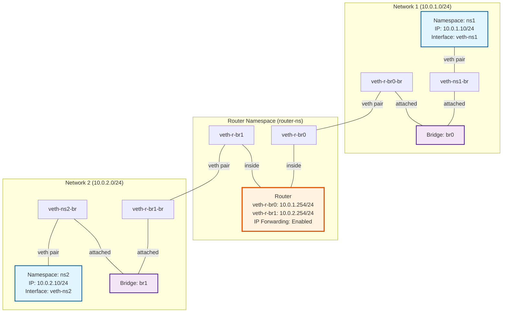
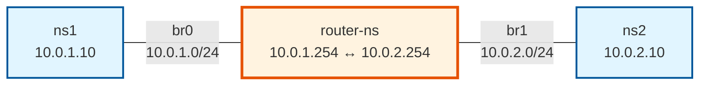
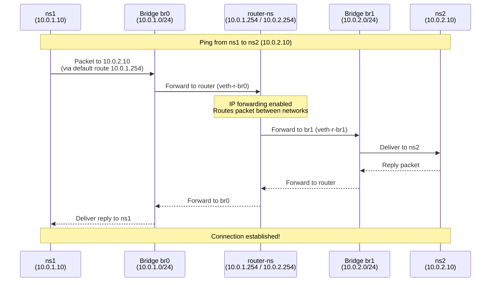

# Network Namespace Simulation - Topology Diagram

## Network Topology

## Simplified View

## Traffic Flow Diagram

## Component Details

### Network Namespaces
- **ns1**: Client namespace in network 1
- **ns2**: Client namespace in network 2
- **router-ns**: Router namespace connecting both networks

### Bridges
- **br0**: Virtual switch for network 1 (10.0.1.0/24)
- **br1**: Virtual switch for network 2 (10.0.2.0/24)

### Virtual Ethernet Pairs
1. **veth-ns1 ↔ veth-ns1-br**: Connects ns1 to br0
2. **veth-ns2 ↔ veth-ns2-br**: Connects ns2 to br1
3. **veth-r-br0 ↔ veth-r-br0-br**: Connects router-ns to br0
4. **veth-r-br1 ↔ veth-r-br1-br**: Connects router-ns to br1

### IP Addressing Scheme

| Component | Interface | IP Address | Network |
|-----------|-----------|------------|---------|
| ns1 | veth-ns1 | 10.0.1.10/24 | Network 1 |
| router-ns | veth-r-br0 | 10.0.1.254/24 | Network 1 |
| router-ns | veth-r-br1 | 10.0.2.254/24 | Network 2 |
| ns2 | veth-ns2 | 10.0.2.10/24 | Network 2 |

### Routing Configuration

**ns1 routing table:**
- Default route: via 10.0.1.254 (router-ns on br0)

**ns2 routing table:**
- Default route: via 10.0.2.254 (router-ns on br1)

**router-ns:**
- IP forwarding: Enabled
- Connected routes: 10.0.1.0/24 and 10.0.2.0/24
